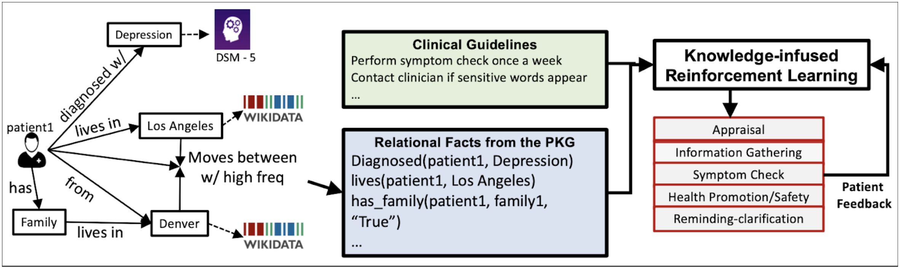

Excited to collaborate with [Kaushik Roy](https://www.linkedin.com/in/kaushik-roy-b8a323ab), [Qi Zhang](https://qizhg.github.io/), and [Amit Sheth](http://amit.aiisc.ai/) on Knowledge Graph Conference Tutorial on _Knowledge-infused Reinforcement Learning_

**Abstract**

This tutorial seeks to showcase AI strategies that provide medical context to patient data with the help of a knowledge graph. This supports personalization through a personalized knowledge graph that captures the patient’s personalized health management objectives within the context of the clinical guidelines and care plan. The continuous capture of this information through the analysis of patient-VHA interactions, and the strategy of creating engaging interactions (conversations) can further augment the personalized knowledge graph. These operations are required to support self-appraisal and self-management, and when necessary perform fail-safe tasks such as connecting the patient to a crisis help-line or professional help. The core innovation is the use of a novel knowledge-infused reinforcement learning method. The by-product of this approach leads to transparency in decision-making with the ability to offer a user understandable explanation. 

* [Website--Coming Soon!!]()
* [Github Link -- Coming Soon!!]()

Illustration of Knowledge-infused Reinforcement Learning using knowledge graph and process knowledge in clinical guidelines to support patients in their goal management.

