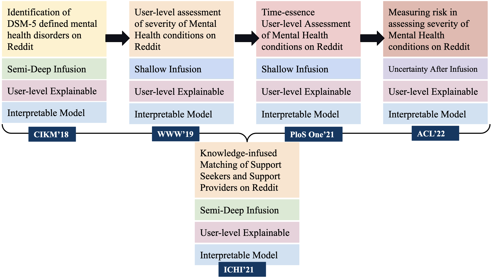

With advances in Natural Language Processing strategies, it is now possible to design automated systems to assess suicide risk. However, such systems may generate uncertain predictions, leading to severe consequences. We hence reformulate suicide risk assessment as a selective prioritized prediction problem over the Columbia Suicide Severity Risk Scale (C-SSRS). We propose SASI, a risk-averse and self-aware transformer-based hierarchical attention classifier, augmented to refrain from making uncertain predictions. We show that SASI is able to refrain from 83% of incorrect predictions on real-world Reddit data. Furthermore, we discuss the qualitative, practical, and ethical aspects of SASI for suicide risk assessment as a human-in-the-loop framework.

[ACL 2022 Paper](https://drive.google.com/file/d/1wr0KwxmSujt2zo-wjDFRAdKe6cPKQTIl/view?usp=sharing)

How this study contribute to the chain of research on Mental Health, Knowledge Graphs, Knowledge-infused Learning, and Human-AI Collaboration?

